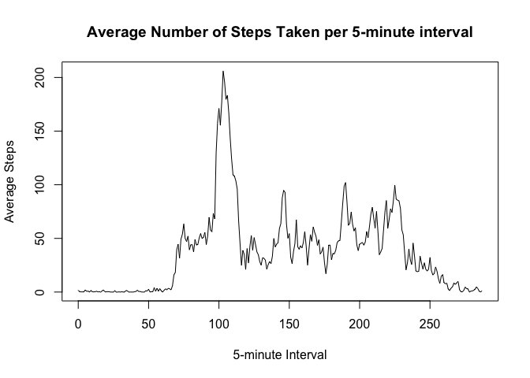

## Loading and preprocessing the data


```r
activitydata<-read.csv(unz("activity.zip", "activity.csv"))
```

There are 288 5-minute intervals and they are initially set up as military time integers, which end abruptly when the 10s digits get to 55 before resetting to 0.  This will cause issues in our plotting so we must reset them to increment regularly.

```r
activitydata$interval <- ((activitydata$interval%/%100)*12)+((activitydata$interval%%100)/5)
```

For our initial data, we are ignoring the days with NA values in the steps (removing them from the dataset), rather than just converting them to a zero value

```r
activitydatanoNA <- activitydata[complete.cases(activitydata),]
```

## What is mean total number of steps taken per day?

First, Calculate the total number of steps per day using dplyr package

```r
library(dplyr)
StepsPerDay <- activitydatanoNA %>% 
        group_by(Date=date) %>% 
        summarise(TotalSteps=sum(steps))
```

Histogram displaying Total Steps Per Day

```r
hist(StepsPerDay$TotalSteps, 
     breaks=20, 
     xlab="Total Steps Per Day", 
     main="Histogram of Total Steps Per Day (20 buckets)")
```

<!-- -->

Mean & Median Steps Per Day

```r
mean(StepsPerDay$TotalSteps)
```

```
## [1] 10766.19
```

```r
median(StepsPerDay$TotalSteps)
```

```
## [1] 10765
```

## What is the average daily activity pattern?

First, Calculate the average number of steps per 5 minute interval using dplyr package

```r
AvgStepsPerInterval <- activitydatanoNA %>% 
        group_by(Interval=interval) %>% 
        summarise(AverageSteps=mean(steps))
```

Make a time series plot of the 5-minute interval (x-axis) and the average number of steps taken, averaged across all days (y-axis)

```r
plot(AvgStepsPerInterval$Interval,
     AvgStepsPerInterval$AverageSteps, 
     type="l",
     xlab="5-minute Interval",
     ylab="Average Steps",
     main="Average Number of Steps Taken per 5-minute interval")
```

<!-- -->

Which 5-minute interval, on average across all the days in the dataset, contains the maximum number of steps?

```r
fiveminuteinterval <- AvgStepsPerInterval[which.max(AvgStepsPerInterval$AverageSteps),"Interval"]
minuteofday<-fiveminuteinterval*5
hourofday<-minuteofday%/%60
minuteofhour<-minuteofday%%60

paste0("The 5-Minute interval which averages the max number of steps is #",fiveminuteinterval,". This corresponds to the 5 minutes beginning at ", hourofday,":",minuteofhour," (24-hr time)")
```

```
## [1] "The 5-Minute interval which averages the max number of steps is #103. This corresponds to the 5 minutes beginning at 8:35 (24-hr time)"
```


## Imputing missing values

Calculate and report the total number of missing values in the original dataset

```r
sum(is.na(activitydata$steps))
```

```
## [1] 2304
```

If there is an NA value in the dataset, use the mean for that 5-minute interval to replace it. This will create a new dataset that is equal to the original dataset but with the missing data filled in.

```r
activitydatafull <- activitydata

##new dataset (with NA values prior to imputing)
sum(is.na(activitydatafull$steps))
```

```
## [1] 2304
```

```r
for(row in 1:nrow(activitydatafull)){
        if(is.na(activitydatafull$steps[row])){
                activitydatafull$steps[row] <- AvgStepsPerInterval[which(AvgStepsPerInterval$Interval==activitydatafull$interval[row]),"AverageSteps"]
        }
}
##new dataset (with no remaining NA values after imputing)
sum(is.na(activitydatafull$steps))
```

```
## [1] 0
```

Make a histogram of the total number of steps taken each day

```r
activitydatafull$steps <- as.numeric(activitydatafull$steps)

StepsPerDayFull <- activitydatafull %>% 
        group_by(Date=date) %>% 
        summarise(TotalSteps=sum(steps))

hist(StepsPerDayFull$TotalSteps, 
     breaks=20, 
     xlab="Total Steps Per Day", 
     main="Histogram of Total Steps Per Day with full dataset (20 buckets)")
```

<!-- -->

Calculate and report the mean and median total number of steps taken per day. 

```r
mean(StepsPerDayFull$TotalSteps)
```

```
## [1] 10766.19
```

```r
median(StepsPerDayFull$TotalSteps)
```

```
## [1] 10766.19
```


Do these values differ from the estimates from the first part of the assignment? What is the impact of imputing missing data on the estimates of the total daily number of steps?

```
Yes, imputing the average values in all of the NA values has skewed the complete dataset to a much more central average.  All of the initially empty days that were ignored are now all equal to the sum of average steps per interval, thus they are all the same at 10766.19.  This also shifts the median to the same value as the mean because the average steps per interval that we imputed were non-integer. 
```

## Are there differences in activity patterns between weekdays and weekends?

Create a new factor variable in the dataset with two levels – “weekday” and “weekend” indicating whether a given date is a weekday or weekend day.


```r
activitydatafull$dayofweek <- weekdays(as.Date(activitydatafull$date))

activitydatafull$dayofweek <- ifelse(activitydatafull$dayofweek %in% c("Saturday", "Sunday"), "weekend", "weekday")

activitydatafull$dayofweek<-as.factor(activitydatafull$dayofweek)

## See that new dayofweek variable in the dataset is now a factor with two levels
str(activitydatafull)
```

```
## 'data.frame':	17568 obs. of  4 variables:
##  $ steps    : num  1.717 0.3396 0.1321 0.1509 0.0755 ...
##  $ date     : Factor w/ 61 levels "2012-10-01","2012-10-02",..: 1 1 1 1 1 1 1 1 1 1 ...
##  $ interval : num  0 1 2 3 4 5 6 7 8 9 ...
##  $ dayofweek: Factor w/ 2 levels "weekday","weekend": 1 1 1 1 1 1 1 1 1 1 ...
```

Make a panel plot containing a time series plot of the 5-minute interval (x-axis) and the average number of steps taken, averaged across all weekday days or weekend days (y-axis).

```r
library(lattice)

AvgStepsPerIntervalFull <- activitydatafull %>% 
        group_by(Interval=interval, DayOfWeek=dayofweek) %>% 
        summarise(AverageSteps=mean(steps))

xyplot(AverageSteps~Interval|DayOfWeek,
       data=AvgStepsPerIntervalFull,
       type="l",
       layout = c(1, 2),
       main="Average number of steps per 5-minute interval\n (Weekends vs Weekdays)",
       ylab="Average Steps", 
       xlab="5-Minute Interval")
```

<!-- -->

